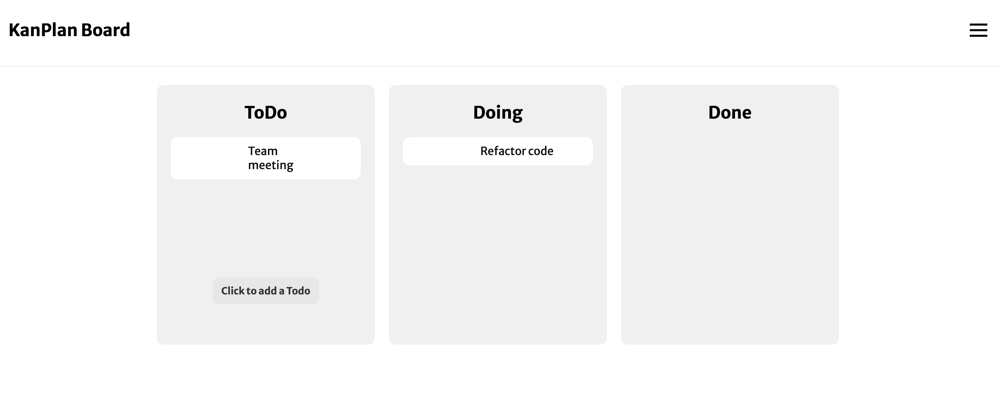

# Kanplan - a kanban board for developers 

Kanplan is a powerful kanban website designed specifically for developers, offering a wide range of functionalities similar to Trello and more. With Kanplan, developers can effectively manage their projects, tasks, and workflows in a visual and organized manner.

## How It's Made:

**Tech used:** EJS, Express, MongoDB

How can members share freely ideas and follow them, team up to accomplish them?
Our idea is to make a board similar to Trello, visible to everyone but only managed by members, and adapted to developpers' need when planning a project.

We decided to use EJS (Embedded JavaScript) to generate dynamic HTML pages on the server-side. EJS provides a high degree of flexibility and control over the generated HTML and can be seamlessly integrated with our backend, made with Node.js and Express. 

We chose to use Express for its performance and scalability, as our project may have multiple users interacting simultaneously.  

## Optimizations

- [ ] Add custom columns to the board
- [ ] Have multiple boards for an user
- [ ] Add date created, and date to be completed on the tasks info
- [ ] Implement drag and drop 
- [ ] Use socket.io for real-time collaboration
- [ ] Assign tasks to users
- [ ] Share a board with other users
- [ ] Customizable background and tasks color
- [ ] Use a photo API (Unsplash) to change board background

## Lessons Learned:

- **Planning** :  We designed and planned the project with various planning tools (Trello, Figma). We broke down tasks and set manageable milestones to make the project more manageable.
- **Collaboration and version control** : This project was a great occasion to think about what is a meaningful collaboration.We used Git and GitHub to maintain a clean and organized codebase.
- **RESTful API design** : We consolidated our knowledge of RESTful API design. We had to define routes, handle HTTP methods and implement CRUD operations, as well as handling authentication.

